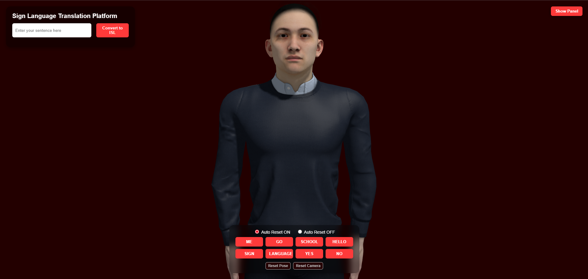
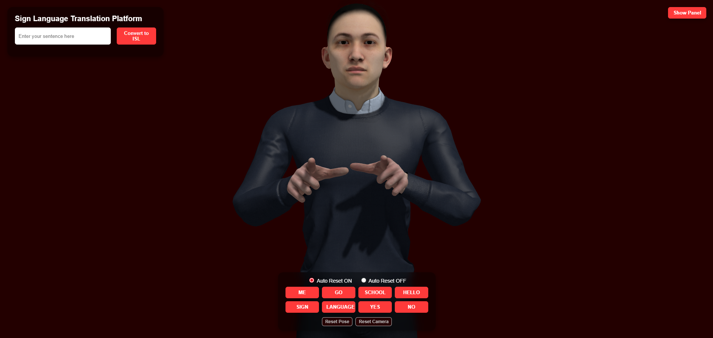
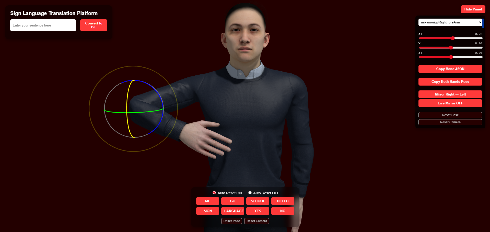

# ISL-Project

### Indian Sign Language Translation Platform

**Developed by:** Mr. Nobody

---

# 📌 Project Overview

The **Indian Sign Language (ISL) Translation Platform** is a web-based system that converts **English text or speech into Indian Sign Language** using a **3D animated avatar**.

The platform aims to improve communication between **hearing individuals and people who are deaf or speech-impaired** by translating spoken or written language into **visual sign language gestures**.

The system uses **Natural Language Processing (NLP)** and **3D animation technology** to generate realistic hand gestures performed by a digital avatar in real time.

---

# 📸 Project Screenshots

## Main Interface



## 3D Avatar Animation



## Bone Control Editor



---

# 🎯 Objectives

* Convert **English text into Indian Sign Language**
* Support **speech-to-text input for translation**
* Provide **real-time sign language animation**
* Improve accessibility for **deaf and speech-impaired users**
* Create an **interactive learning and demonstration tool**

---

# ⚙️ Technologies Used

## Frontend

* HTML
* CSS
* JavaScript
* Three.js (3D rendering)

## Backend

* Python
* Flask

## Natural Language Processing

* NLTK

## 3D Animation

* FBX Character Model
* Mixamo Rigging
* Bone-based animation system

---

# 🧠 System Workflow

1. The user enters **text or uses voice input**.
2. The input is sent to the **Flask backend server**.
3. NLP processing converts the sentence into **ISL word order**.
4. The processed words are returned to the frontend.
5. The **3D avatar performs sign gestures sequentially**.
6. Each word is visually highlighted while its gesture is played.

---

# 📂 Project Structure

```
ISL-Project
│
├── app.py
├── utils
│   └── isl_processor.py
│
├── static
│   ├── css
│   │   └── style.css
│   ├── js
│   │   └── index.js
│   ├── models
│   │   └── character.fbx
│   ├── images
│   └── isl_data.json
│
├── templates
│   └── index.html
│
└── README.md
```

---

# 🚀 Features

### Translation

* English text → ISL translation
* Speech-to-text input support
* NLP-based ISL word ordering

### 3D Animation

* Real-time 3D avatar animation
* Sequential gesture playback
* Word highlighting during animation

### Gesture Editing Tools

* Bone control panel
* Real-time bone rotation sliders
* Pose export to JSON
* Gesture mirroring (right ↔ left)
* Gesture creation system

### Interface Controls

* Auto reset toggle
* Camera reset
* Pose reset
* Gesture testing buttons

---

# 💡 Future Improvements

* Larger ISL vocabulary database
* AI-based gesture generation
* Real-time speech translation
* Mobile and touch support
* Continuous sign language animation
* Integration with webcam gesture recognition

---

# 🎓 Academic Purpose

This project is developed as a **Final Year Project (FYP)** focusing on:

* Natural Language Processing
* Assistive Technology
* 3D Animation Systems
* Human Computer Interaction
* Accessibility Solutions

---

# 👨‍💻 Author

**Mr. Nobody**

GitHub
[https://github.com/MGiftsonRaj40](https://github.com/MGiftsonRaj40)

---

✅ This version is:

* **Cleaner for GitHub**
* **More professional for evaluation**
* Includes your **speech feature**
* Better structured for **open-source readability**

---

If you want, I can also give you a **🔥 "GitHub-level README upgrade"** with:

* badges
* demo video section
* architecture diagram
* installation guide

That would make your repo look **like a professional open-source AI project**.
